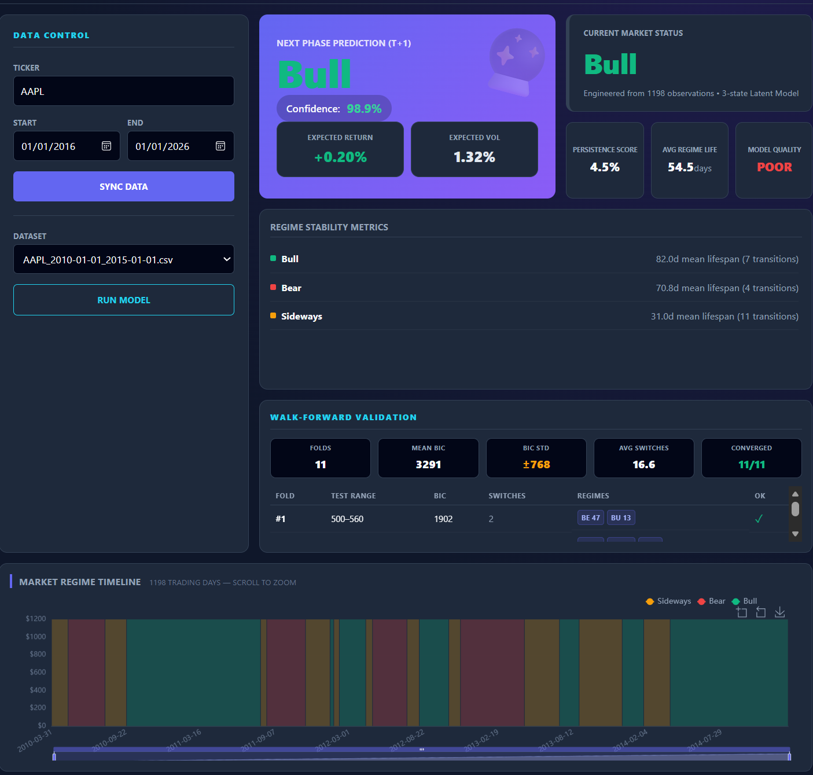

# FinViewer | HMM Market Regime Intelligence


**FinViewer** is a specialized quantitative dashboard engineered to decode **Latent Market Regimes** (Bull, Bear, Sideways) using **Gaussian Hidden Markov Models (HMM)**.

Unlike traditional technical indicators (MACD, RSI) which are lagging by nature, FinViewer leverages probabilistic graphical models to infer the hidden states driving market volatility and log-returns, providing forward-looking state probabilities for the $t+1$ timeframe.

---

## 📸 Intelligence Dashboard


*(A professional 16:10 Command Center layout featuring Bento Grid design)*

---

## 🧠 Quantitative Framework

The core engine implements a **Gaussian Mixture Model (GMM)** coupled with a Markov process to model non-linear financial time-series data.

### 1. Feature Engineering
Raw OHLCV data is transformed into stationary features to ensure EM algorithm convergence:
* **Logarithmic Returns:**
  $$r_t = \ln\left(\frac{P_t}{P_{t-1}}\right)$$
* **Realized Volatility (Rolling Window $w$):**
  $$\sigma_t = \sqrt{\frac{1}{w-1} \sum_{i=0}^{w-1} (r_{t-i} - \bar{r})^2}$$

### 2. The HMM Architecture
The market is modeled as a system $\lambda = (A, B, \pi)$ where:
* **Hidden States ($S$):** Unobservable market regimes (e.g., Low Volatility Bull, High Volatility Bear).
* **Transition Matrix ($A$):** The probability of switching from regime $i$ to regime $j$:
  $$a_{ij} = P(q_{t+1} = S_j | q_t = S_i)$$
* **Emission Probability ($B$):** The likelihood of observing specific returns/volatility given a regime.

### 3. Inference & Decoding
* **Parameter Estimation:** Uses the **Baum-Welch (EM)** algorithm to maximize likelihood.
* **State Decoding:** Applies the **Viterbi Algorithm** to determine the optimal sequence of historical states.
* **Forecasting:** Projects the next state vector via matrix multiplication: $\pi_{t+1} = \pi_t \times A$.

---

## 🚀 Key Features

### Quantitative Engine (Backend)
* **Unsupervised Learning:** Automatically detects 3-5 market regimes without labeled data.
* **Model Selection:** Implements **BIC (Bayesian Information Criterion)** to penalize overfitting.
* **Stability Metrics:** Calculates Regime Persistence Score, Average Lifespan, and Transition Stability.
* **Data Integrity:** Auto-adjusts for stock splits and dividends via Yahoo Finance API.

### Command Center (Frontend)
* **Bento Grid Layout:** Optimized for high-resolution 16:10 displays (Zero-Scroll).
* **Visual Analytics:** Full-width Regime Timeline and Probability Distribution charts.
* **Real-time Insights:** Instant display of Confidence Scores ($P > 80\%$) and Expected Volatility.

---

## 🛠 Tech Stack

| Component | Technology | Description |
| :--- | :--- | :--- |
| **Math Core** | `hmmlearn`, `scikit-learn`, `numpy` | Gaussian HMM, EM Algorithm, Viterbi |
| **Data Processing** | `pandas`, `yfinance` | Time-series manipulation, Data ingestion |
| **API** | `FastAPI`, `Uvicorn` | Async REST endpoints, Pydantic validation |
| **Frontend** | `React 18`, `TypeScript` | Component-based UI Architecture |
| **Visualization** | `ECharts` | Interactive financial charting |
| **Automation** | `Python Scripts`, `Batch` | Environment setup and execution |

---

## ⚡ Getting Started

### Prerequisites
* Python 3.10+
* Node.js 18+

### 1. Initialization (First Run)
If you have just cloned the repository, run the setup script to generate the necessary folder structure and environment configurations:

```bash
python setup_structure.py
