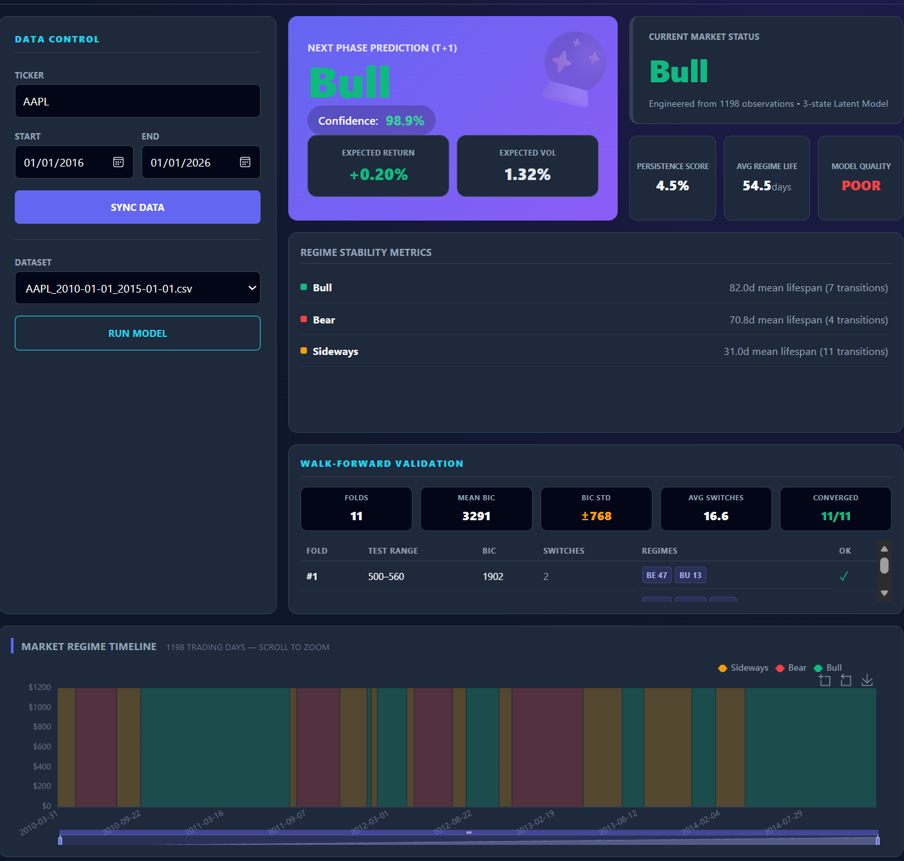

# FinViewer | HMM Market Regime Intelligence

  

**FinViewer** is a specialized quantitative dashboard engineered to decode Latent Market Regimes (Bull, Bear, Sideways) using Gaussian Hidden Markov Models (HMM). 

Unlike traditional technical indicators (MACD, RSI) which are lagging by nature, FinViewer leverages probabilistic graphical models to infer the hidden states driving market volatility and log-returns, providing forward-looking state probabilities for the $t+1$ timeframe.

---

## 📸 Intelligence Dashboard

> *Dashboard Preview: A professional 16:10 Command Center layout featuring a Bento Grid design, Walk-forward validation metrics, and interactive ECharts timelines.*



---

## ⚙️ System Architecture & Pipeline
The project implements a robust, end-to-end data pipeline designed to prevent look-ahead bias and handle non-stationary financial data.

1. **Input Layer:** Fetches OHLCV price data via Yahoo Finance, managed by a dedicated data service that persists raw Date-indexed CSVs.
2. **Feature Engineering:** Computes Log Returns and 30-day Rolling Volatility, followed by Z-score normalization (`StandardScaler`) to ensure numerical stability.
3. **Core Engine:** Applies a Gaussian HMM trained via the Baum-Welch EM algorithm, utilizing Viterbi decoding to extract the optimal state sequence. Regimes are systematically labeled by sorting mean returns.
4. **Validation Layer:** Employs an expanding-window **Walk-forward** validation. Crucially, it includes a **Persistence check** (average regime lifespan) and a **Label flip fix** (Centroid matching) to maintain state consistency across multiple folds.
5. **Output Layer:** Projects $t+1$ predictions and feeds state-level statistics into the FastAPI backend, driving the React/ECharts interactive dashboard.

---

## 🧠 Quantitative Framework
The core engine implements a Gaussian Mixture Model (GMM) coupled with a Markov process to model non-linear financial time-series data.

### 1. Feature Transformations
Raw OHLCV data is transformed into stationary features to ensure EM algorithm convergence:

* **Logarithmic Returns:**
$$r_t = \ln\left(\frac{P_t}{P_{t-1}}\right)$$

* **Realized Volatility (Rolling Window $w$):**
$$\sigma_t = \sqrt{\frac{1}{w-1}\sum_{i=0}^{w-1}(r_{t-i} - \bar{r})^2}$$

### 2. The HMM Architecture
The market is modeled as a probabilistic system $\lambda = (A, B, \pi)$ where:
* **Hidden States ($S$):** Unobservable market regimes (e.g., Low Volatility Bull, High Volatility Bear).
* **Transition Matrix ($A$):** The probability of switching from regime $i$ to regime $j$:
$$a_{ij} = P(q_{t+1} = S_j | q_t = S_i)$$
* **Emission Probability ($B$):** The likelihood of observing specific returns/volatility given a regime, utilizing a full covariance matrix.

### 3. Inference & Decoding
* **Parameter Estimation:** Uses the Baum-Welch (EM) algorithm to maximize likelihood.
* **State Decoding:** Applies the Viterbi Algorithm to determine the optimal sequence of historical states.
* **Forecasting:** Projects the next state vector via matrix multiplication: 
$$\pi_{t+1} = \pi_t \times A$$

---

## 🚀 Key Features

### Quantitative Engine (Backend)
* **Unsupervised Learning:** Automatically detects latent market regimes without labeled data.
* **Robust Validation:** Walk-forward expanding window folds with built-in Label Flip fixing via centroid matching.
* **Model Selection:** Implements BIC (Bayesian Information Criterion) to penalize overfitting.
* **Stability Metrics:** Calculates Regime Persistence Score, Average Lifespan, and Transition Stability.

### Command Center (Frontend)
* **Bento Grid Layout:** Optimized for high-resolution 16:10 displays (Zero-Scroll experience).
* **Visual Analytics:** Full-width Regime Timeline with color bands and Probability Distribution charts.
* **Real-time Insights:** Instant display of Confidence Scores and state-specific characteristics.

---

## 🛠 Tech Stack

| Component | Technology | Description |
| :--- | :--- | :--- |
| **Math Core** | `hmmlearn`, `scikit-learn`, `numpy` | Gaussian HMM, EM Algorithm, Viterbi |
| **Data Processing** | `pandas`, `yfinance` | Time-series manipulation, Data ingestion |
| **API Backend** | `FastAPI`, `Uvicorn` | Async REST endpoints, Pydantic validation |
| **Frontend** | `React 18`, `TypeScript` | Component-based UI Architecture |
| **Visualization** | `ECharts` | Interactive financial charting |
| **Automation** | Python Scripts, Batch | Environment setup and execution |

---

## ⚡ Getting Started

### Prerequisites
* Python 3.10+
* Node.js 18+

### Initialization (First Run)
If you have just cloned the repository, run the setup script to generate the necessary folder structure and environment configurations:

```bash
python setup_structure.py
